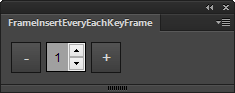
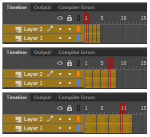

FrameInsertEveryEachKeyFrame
=======

FrameInsertEveryEachKeyFrame is an extension panel for Flash Pro CC.
It increased or decreased in a frame in each key frames of all selected layers.

FrameInsertEveryEachKeyFrame は Flash Pro CC 用 拡張パネルです。
選択した全てのレイヤーの各キーフレームに対し、フレームを増減させます。

---
## Download (Flash Pro CC)

* [FrameInsertEveryEachKeyFrame.zxp](https://raw.github.com/siratama/FrameInsertEveryEachKeyFrame/master/download/FrameInsertEveryEachKeyFrame.zxp)

This can be used by Flash CC 13.1 or later. In the case of Windows, it can save from a right-click. 
[Extension Manager Command Line tool(ExManCmd)](https://www.adobeexchange.com/resources/28) is required in order to install. 

Flash CC 13.1 以降のバージョンで利用可能です。Windows の場合、右クリックから「リンク先のコンテンツを保存」を選択で保存できます。
インストールには別途 [Extension Manager Command Line tool(ExManCmd)](https://www.adobeexchange.com/resources/28)が必要です。

---
## Download (JSFL)

* [FrameInsertEveryEachKeyFrame.jsfl](https://raw.github.com/siratama/FrameInsertEveryEachKeyFrame/master/download/FrameInsertEveryEachKeyFrame.jsfl)
* [FrameRemoveEveryEachKeyFrame.jsfl](https://raw.github.com/siratama/FrameInsertEveryEachKeyFrame/master/download/FrameRemoveEveryEachKeyFrame.jsfl)

